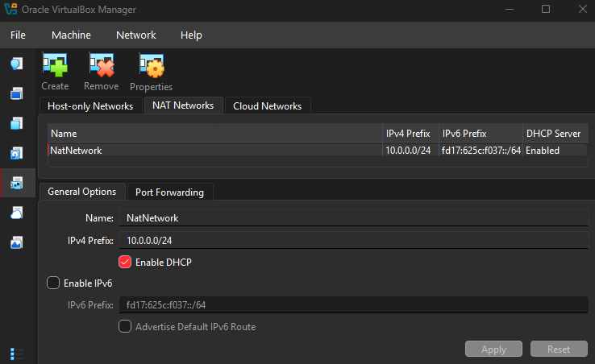
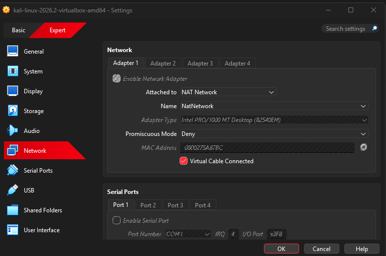
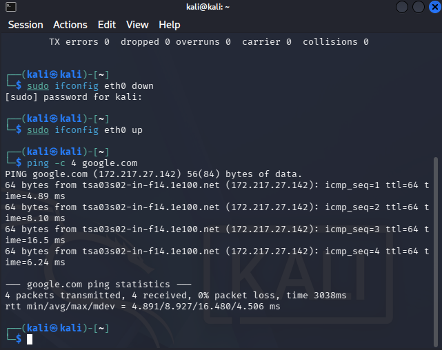
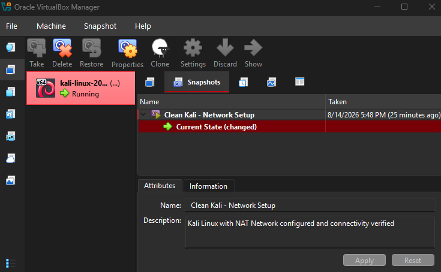

# 💻 Cybersecurity Lab Environment Setup

**VirtualBox • Kali Linux • NAT Networking • Linux Networking**

<p align="center">
  
  
  
  
  
</p>

---

# 🎯 Lab Purpose

The purpose of this lab is to build a controlled virtual environment for learning and practicing cybersecurity concepts using **Kali Linux** and **Oracle VirtualBox**.

The virtual laboratory provides a dedicated environment where networking, Linux administration, security tools, vulnerability assessment, and authorized penetration-testing activities can be practiced without directly experimenting on production systems.

This environment will serve as the foundation for future cybersecurity laboratory exercises.

---

# 🖥️ Lab Environment

| **Component** | **Details** |
|---|---|
| 🖥️ Host Operating System | Windows 11 |
| ⚡ Processor | 12th Gen Intel Core i5-12500H |
| 🧠 Host RAM | 24 GB DDR4 |
| 🧰 Hypervisor | Oracle VirtualBox 7.2.14 r174565 |
| 🐉 Security OS | Kali Linux 2026.2 |
| 🧠 Kali RAM | 2048 MB |
| 🌐 Virtual Network | NAT Network |
| 📡 NAT Network Name | NatNetwork |
| 📶 Network Address | 10.0.0.0/24 |
| 📍 Kali IP Address | 10.0.0.2/24 |
| 🚪 Default Gateway | 10.0.0.1 |
| 🌎 DNS Server | 8.8.8.8 |

> **Note:** 7-Zip and Oracle VirtualBox were already installed on the host system before this laboratory setup. The work for this lab therefore focused on preparing Kali Linux and configuring the virtual networking environment.

---

# 🧰 Existing Tools

Before starting this laboratory, the following software was already available on the host machine:

- 7-Zip
- Oracle VirtualBox 7.2.14
- Windows 11

### Software Added / Prepared for the Lab

- Kali Linux 2026.2

---

# 🪜 Lab Setup Procedure

## 1️⃣ Kali Linux 2026.2

### What I Did

Downloaded the **Kali Linux 2026.2 virtual machine package** for use with Oracle VirtualBox.

The Kali Linux VM was prepared as the primary security workstation for the laboratory.

### Why

Kali Linux provides a dedicated environment containing tools commonly used for cybersecurity learning, network analysis, vulnerability assessment, penetration testing, and other authorized security exercises.

### Kali Configuration

```text
Operating System : Kali Linux 2026.2
RAM              : 2048 MB
Network Adapter  : Adapter 1
Network Type     : NAT Network
Network Name     : NatNetwork
```

**Status:** ✅ Completed

---

## 2️⃣ NAT Network Configuration

### What I Did

Configured the VirtualBox NAT Network used by the cybersecurity laboratory.

### Network Configuration

```text
Network Type : NAT Network
Network Name : NatNetwork
IPv4 Prefix  : 10.0.0.0/24
DHCP         : Enabled
IPv6         : Disabled
```

### Why

A NAT Network provides a dedicated virtual network where multiple laboratory virtual machines can communicate with one another while maintaining outbound network connectivity.

This also allows additional target or testing machines to be added to the same laboratory network during future exercises.

**Status:** ✅ Completed

**📸 Screenshot**



---

## 3️⃣ Kali Linux Virtual Machine Setup

### What I Did

Connected the Kali Linux virtual machine to the configured NatNetwork through VirtualBox Adapter 1.

### Adapter Configuration

```text
Adapter        : Adapter 1
Attached to    : NAT Network
Network Name   : NatNetwork
RAM            : 2048 MB
```

### Why

Connecting Kali Linux to the dedicated NAT Network provides a controlled environment for network communication and allows future laboratory machines to be connected to the same virtual network.

**Status:** ✅ Completed

**📸 Screenshot**



---

## 4️⃣ Kali Linux Network Configuration

### What I Did

Configured and verified the network settings of the Kali Linux eth0 interface, then tested connectivity.

The resulting configuration was:

```text
Interface    : eth0
IP Address   : 10.0.0.2/24
Subnet Mask  : 255.255.255.0
Gateway      : 10.0.0.1
DNS          : 8.8.8.8
```

### Why

A consistent IP configuration makes the Kali machine easier to identify and reference during future cybersecurity exercises. Cycling the interface down and up confirms the configuration is applied correctly and persists after a restart of the adapter.

### Interface Verification

The `ifconfig` command confirmed the Kali Linux interface and IP address:

```bash
ifconfig
```

```text
eth0: flags=4163<UP,BROADCAST,RUNNING,MULTICAST>  mtu 1500
        inet 10.0.0.2  netmask 255.255.255.0  broadcast 10.0.0.255
```

### Interface Restart Test

The interface was taken down and brought back up to confirm the configuration reapplies correctly:

```bash
sudo ifconfig eth0 down
sudo ifconfig eth0 up
```

### Connectivity Test

DNS resolution and external connectivity were verified with a short ping test:

```bash
ping -c 4 google.com
```

```text
Packets transmitted : 4
Packets received    : 4
Packet loss         : 0%
```

**Status:** ✅ Completed

**📸 Screenshot**



---

## 5️⃣ Create a Clean VM Snapshot

### What I Did

After completing the initial configuration, a VirtualBox snapshot was created to preserve the working baseline of the lab.

**Status:** ✅ Completed

**📸 Screenshot**



---

# 🎥 Project Demo

A short demonstration video is included to show the completed cybersecurity laboratory environment.

The demonstration covers:

- Kali Linux running inside VirtualBox
- VirtualBox NAT Network configuration
- Kali Linux VM network configuration
- Interface verification and restart
- Connectivity testing

📹 **Demo Video:** [Watch the demo]([https://www.youtube.com/watch?v=REPLACE_WITH_YOUR_VIDEO_ID](https://youtu.be/5-4mZ_lexPA?si=ANMacmEApstPLh0G))

---

# 🧠 Key Takeaways

This laboratory served primarily as a practical refresher and reinforcement of concepts I had already encountered academically.

The hands-on setup reinforced my understanding of:

- Virtual machine environments
- Linux networking
- IPv4 addressing and subnetting
- NAT and virtual networking
- Default gateways and routing
- Network connectivity troubleshooting
- Kali Linux as a cybersecurity workstation
- Command-line tools for network verification
- Using snapshots to preserve a clean baseline environment

The laboratory also provided an opportunity to connect previously learned cybersecurity concepts with an actual working environment rather than relying only on theoretical or classroom exercises.

---

# 🔐 Security & Ethical Use

This laboratory is intended for educational and authorized cybersecurity practice only.

Security testing should only be performed against systems, applications, networks, or devices that are owned by the user or where explicit authorization has been provided.

The virtual environment is designed to provide a controlled space for future cybersecurity exercises and experimentation.

---

# 👨‍🏫 Mentor

**Waqas Karim (CCIE)**

This laboratory was completed under the technical guidance of Waqas Karim, providing an opportunity to reinforce existing cybersecurity knowledge through practical environment setup and hands-on networking configuration.

Thank you for the guidance and for providing a practical environment to strengthen my cybersecurity skills.

---

*Cybersecurity Laboratory — Week 01*

